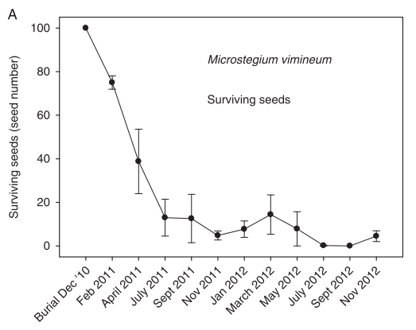
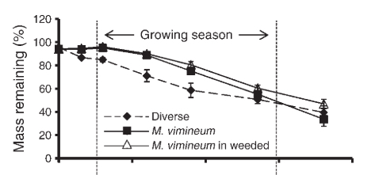

```{r options, include = F}
library(knitr)
# wrap text
opts_chunk$set(tidy.opts=list(width.cutoff = 70), tidy = T)
```

# Set-up
```{r set-up, message = F, warning = F}
# clear 
rm(list=ls())

# load libraries
library(tidyverse)
library(brms)
library(glmmTMB)
```


# Annual plant parameters

## events
1. seeds germinate or don't  
    a. germination depends on the amount of litter      
2. seeds that don't germinate (i.e., dormant) must survive to the next spring (1 year)  
3. germinants grow and produce more seeds  
    a. growth depends on competition  
4. newly produced seeds must survive to the next spring (overwinter)  

## annual germination in the absence of litter
*Microstegium vimineum* germination from 200 planted seeds and an estimated number of background seeds based on a neighboring subplot in plots with litter removed. Methods: field_litter_experiment_2018.docx.

```{r g.A}
# import models
load("../../big-oaks-field-experiment-2018-2019/microstegium-bipolaris/output/mv_germination_litter_model_2018_litter_exp.rda")

# extract fixed effects
A_germ_est <- fixef(mv_germ_litter_mod) %>%
  as_tibble() %>%
  mutate(parm = c("max_germ_autoclaved", "max_germ_live", "alpha_autoclaved", "alpha_live"))

# select the no-litter values
g.A_parms <- filter(A_germ_est, parm == "max_germ_live") %>%
  mutate(Estimate = Estimate / 200,
         Q2.5 = Q2.5 / 200,
         Q97.5 = Q97.5 / 200)

# check
g.A_parms$Estimate
```

## reduced annual germination due to litter
Same experiment as above except also using plots with litter added

```{r beta.A, out.width = "50%", tidy = F}
# select the no-litter values
beta.A_parms <- filter(A_germ_est, parm == "alpha_live")

beta.A_parms$Estimate
```

## survival of dormant annual seeds
We used the survival data collected by Redwood et al. (2018) in November 2011 (buried for one year). Some of these seeds would have germinated had they been exposed to a germination test earlier in the year. Scroll down to seed viability for final survival value.

```{r s.A}
# load extracted figure data
rw18_2a <- read_csv("../data/Redwood_2018_Fig2A.csv")

# select month
(s.A0 <- filter(rw18_2a, month == "Nov 11") %>%
  select(surv) %>%
  round(digits = 1) / 100)
```

## survival of annual seedlings
Survival is not clearly affected by density, so the raw data mean is used.

```{r h.A}
summer_surv <- read_csv("../../big-oaks-field-experiment-2018-2019/microstegium-bipolaris/intermediate-data/summer_survival_data_2019_dens_exp.csv")

(h.A <- summer_surv %>%
    filter(plant_type == "Mv seedling" & treatment == "water") %>%
    summarise(h.A = mean(survival)))
```

## growth of annual in the absence of competition
We oven-dried and weighed individual *M. vimineum* at the end of the growing season in 2019. Methods: field_density_experiment_2018_2019.docx

```{r v.A, out.width = "50%"}
# import model
load("../../big-oaks-field-experiment-2018-2019/microstegium-bipolaris/output/mv_biomass_combined_background_model_2019_density_exp.rda")

# extract fixed effects
A_bio_est <- fixef(mv_bio_mod) %>%
  as_tibble() %>%
  mutate(parm = c("max_bio_fungicide", "max_bio_water", "alpha_EvA_fungicide", "alpha_EvA_water", "alpha_EvS_fungicide", "alpha_EvS_water", "alpha_MvS_fungicide", "alpha_MvS_water"),
         treatment = rep(c("fungicide", "water"), 4),
         parm_type = c(rep("max_bio", 2), rep("alpha", 6)))

# select intercept with disease suppression
v.A_parms <- filter(A_bio_est, treatment == "water" & parm_type == "max_bio")

# check
v.A_parms$Estimate
```

## reduction in annual growth due to competition

```{r alpha.A}
# subset data
A_alpha_dat <- filter(A_bio_est, treatment == "water" & parm_type == "alpha")

# print values
A_alpha_dat %>%
  select(parm, Estimate)
```

## conversion from annual biomass to seed production

```{r y.A, out.width = "50%"}
# treatments are combined because fungicide treatment values led to fluctuations in Elymus seedlings that made simulations difficult to interpret

# import model
load("../../big-oaks-field-experiment-2018-2019/microstegium-bipolaris/output/mv_seeds_per_biomass_no_treatment_model_2018_2019_density_exp.rda")

# look at coefficients
summary(mv_seed_bio_no_treat_mod)

# manually define intercept: intercept + year2 
(y.Aint0 <- exp(6.9224 - 2.4754))

# manually add up relevant coefficients (biomass, year2:biomass)
(y.A <- 0.2299 + 0.6077)
```

## annual seed viability
Using Fig. 2A from Redwood et al. (2018), 40% of the seeds survive from December to April. Survival is the sum of germinated and viable non-germinated seeds. This parameter would only be applied to newly produced seeds (i.e., multiply y.A by w.A). Note that empirical values for seed bank survival include both viability and longer term survival. We divide by viability to get the new survival value because these will be effectively multiplied again in the model.

```{r w.A, out.width = "50%"}

w.A <- 0.4
(y.Aint <- y.Aint0 * w.A)
(s.A <- s.A0 / w.A)
```


# Annual litter parameters

## events
1. newly formed biomass loses water and slightly decomposes over the winter  
2. litter decomposes each year  

## conversion from annual biomass to litter
We measured biomass from the same area in the same plots with adjacent samples in October 2018 and April 2019.
Note: source code needs to be located, but I'm fairly confident this value is correct.

```{r a, out.width = "50%"}
# import data
A_lit_dat <- read_csv("../../big-oaks-field-experiment-2018-2019/microstegium-bipolaris/intermediate-data/mv_seeds_biomass_covariates_2018_density_exp.csv")

# take average of litter/biomass measurements 
(a <- A_lit_dat %>%
    filter(treatment == "water") %>%
    summarise(a = mean(litter_conversion, na.rm = T)))
# a gain in biomass does not make sense
a <- 1
```

## annual litter decomposition
We used the mass remaining in the litter bags from DeMeester and Richter (2010) after one year in the field.

```{r b}
# import data
dr10_3 <- read_csv("../data/DeMeester_2010_Fig3.csv")

# figure


# extract parameters
(b <- 1 - filter(dr10_3, days == max(dr10_3$days)) %>% select(mass.prop)/100)
```


# Perennial plant parameters

## events
1. seeds germinate or don't  
    a. germination depends on the amount of litter      
2. seeds that don't germinate (i.e., dormant) must survive to the next spring (1 year)  
3. germinants grow and produce more seeds  
    a. growth depends on competition  
4. newly produced seeds must survive to the next spring (overwinter)   
5. seedlings that survive to the next spring become adults (1 year)  
6. adults also produce seeds, which depends on competition  

## perennial germination in the absence of litter
*Elymus virginicus* germination from 50 planted seeds in field plots with litter removed and in greenhouse pots. Methods: field_litter_experiment_2019.docx, REU 2018 manuscript.
```{r g.S}
# import data
S_field_germ_dat <- read_csv("../../big-oaks-field-experiment-2018-2019/microstegium-bipolaris/data/both_germination_disease_jun_2019_litter_exp.csv") 
S_house_germ_dat <- read_csv("../../microstegium-litter-reu/output/ev_establishment_data.csv") 

# estimate from field
g.S_field <- filter(S_field_germ_dat, treatment == "removal") %>%
  mutate(prop_germ = ev_germ/50) %>%
  summarise(g.S = mean_cl_boot(prop_germ)$y,
            g.S_low = mean_cl_boot(prop_germ)$ymin,
            g.S_hi = mean_cl_boot(prop_germ)$ymax)

# estimate from greenhouse
g.S_house <- filter(S_house_germ_dat, Litter == "None" & SpPresent == "Ev") %>%
  mutate(prop_germ = NewGermEv/50) %>%
  summarise(g.S = mean_cl_boot(prop_germ)$y,
            g.S_low = mean_cl_boot(prop_germ)$ymin,
            g.S_hi = mean_cl_boot(prop_germ)$ymax)

g.S_field$g.S
g.S_house$g.S
(g.S <- mean(c(g.S_field$g.S, g.S_house$g.S)))

```

## reduced perennial germination due to litter
Same experiment as above except also using plots with litter added

```{r beta.S, out.width = "50%", tidy = F}

# presence/absence of litter matters
# based on ev_germination_analysis_2018_litter_exp, seed germination basically drops to zero with any litter in the field
# better estimate from greenhouse
# the presence/absence function made the simulation act weird, so I fit a Beverton-Holt function to the greenhouse data

# import model
load("../../microstegium-litter-reu/output/ev_beverton_holt_establishment_modl.rda") 

# summary
summary(ev_bh_mod)

# save beta
(beta.S <- fixef(ev_bh_mod)[2, 1])
```

## survival of dormant perennial seeds
Garrison and Stier (2010) reported that 9% of seeds were viable (all germinated) after buried for one year.
```{r s.S}
s.S0 <- 0.09
```

## perennial seed viability
Garrison and Stier (2010) reported that 83% of seeds were viable at the beginning of the study
```{r w.S}
w.S <- 0.83
(s.S <- s.S0/w.S)
```


## growth of perennial in the absence of competition
We oven-dried and weighed individual *E. virginicus* at the end of the growing season in 2019. Methods: field_density_experiment_2018_2019.docx

```{r v.SP, out.width = "50%"}
# import models
load("../../big-oaks-field-experiment-2018-2019/microstegium-bipolaris/output/ev_seedling_biomass_combined_background_model_2019_density_exp.rda")
load("../../big-oaks-field-experiment-2018-2019/microstegium-bipolaris/output/ev_adult_biomass_combined_background_model_2019_density_exp.rda")

# extract fixed effects
S_bio_est <- fixef(evs_bio_mod) %>%
  as_tibble() %>%
  mutate(parm = c("max_bio_fungicide", "max_bio_water", "alpha_EvA_fungicide", "alpha_EvA_water", "alpha_EvS_fungicide", "alpha_EvS_water", "alpha_MvS_fungicide", "alpha_MvS_water"),
         treatment = rep(c("fungicide", "water"), 4),
         parm_type = c(rep("max_bio", 2), rep("alpha", 6)))

P_bio_est <- fixef(eva_bio_mod) %>%
  as_tibble() %>%
  mutate(parm = c("max_bio_fungicide", "max_bio_water", "alpha_EvA_fungicide", "alpha_EvA_water", "alpha_EvS_fungicide", "alpha_EvS_water", "alpha_MvS_fungicide", "alpha_MvS_water"),
         treatment = rep(c("fungicide", "water"), 4),
         parm_type = c(rep("max_bio", 2), rep("alpha", 6)))

# select intercept with disease suppression
v.S_parms <- filter(S_bio_est, treatment == "water" & parm_type == "max_bio")
v.P_parms <- filter(P_bio_est, treatment == "water" & parm_type == "max_bio")

# check
v.S_parms$Estimate
v.P_parms$Estimate
```

## reduction in perennial seedling growth due to competition

```{r alpha.S}
# subset data
S_alpha_dat <- filter(S_bio_est, treatment == "water" & parm_type == "alpha")

# print values
S_alpha_dat %>%
  select(parm, Estimate)
```
## reduction in perennial seedling growth due to competition

```{r alpha.P}
# subset data
P_alpha_dat <- filter(P_bio_est, treatment == "water" & parm_type == "alpha")

# print values
P_alpha_dat %>%
  select(parm, Estimate)
```

## conversion from perennial biomass to seed production

```{r y.S and y.P, out.width = "50%"}
# treatments are combined because fungicide treatment values led to fluctuations in Elymus seedlings that made simulations difficult to interpret

# import model
load("../../big-oaks-field-experiment-2018-2019/microstegium-bipolaris/output/ev_seeds_per_biomass_no_treatment_model_2019_density_exp.rda")

# look at coefficients
summary(ev_seed_bio_no_treat_mod)

# manually add up intercept values (intercept, age)
(y.Sint0 <- exp(2.0709 - 0.5426))
(y.Pint0 <- exp(2.0709))

# manually add up relevant coefficients (biomass, age:biomass)
(y.S <- 1.1918 - 0.3162)
(y.P <- 1.1918)

# multiply by viability
(y.Sint <- y.Sint0 * w.S)
(y.Pint <- y.Pint0 * w.S)
```

## seedling and adult survival
Winter survival only includes those that survived the summer. Summer and winter survival are multiplied for a full year of survival.

```{r h.S and h.P}
winter_surv <- read_csv("../../big-oaks-field-experiment-2018-2019/microstegium-bipolaris/intermediate-data/winter_survival_data_2018_2019_dens_exp.csv")

(h.S <- summer_surv %>%
    filter(plant_type == "Ev seedling" & treatment == "water") %>%
    summarise(summer = mean(survival)) %>%
    merge(winter_surv %>%
                filter(plant_type == "Ev seedling" & treatment == "water") %>%
                summarise(winter = mean(survival)), all = T) %>%
    mutate(yearly = summer * winter))

(h.P <- summer_surv %>%
    filter(plant_type == "Ev adult" & treatment == "water") %>%
    summarise(summer = mean(survival)) %>%
    merge(winter_surv %>%
                filter(plant_type == "Ev adult" & treatment == "water") %>%
                summarise(winter = mean(survival)), all = T) %>%
    mutate(yearly = summer * winter))
```

