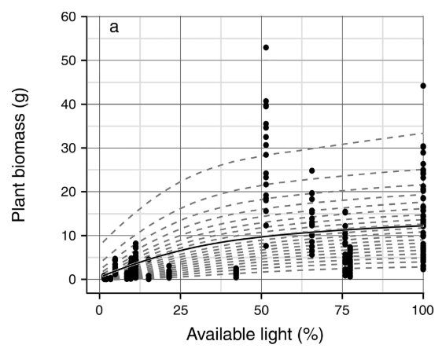

```{r options, include = F}
library(knitr)
# wrap text
opts_chunk$set(tidy.opts=list(width.cutoff = 70), tidy = T)
```

# Set-up
```{r set-up, message = F, warning = F}
# clear 
rm(list=ls())

# load libraries
library(tidyverse)

# load extracted figure data
rw18_2a <- read_csv("../data/Redwood_2018_Fig2A.csv")
rw18_2b <- read_csv("../data/Redwood_2018_Fig2B.csv")
fg98_1b <- read_csv("../data/Foster_1998_Fig1b.csv")
fg98_3a <- read_csv("../data/Foster_1998_Fig3A.csv")
wi15_3b <- read_csv("../data/Wilson_2015_Fig3B.csv")
dr10_3 <- read_csv("../data/DeMeester_2010_Fig3.csv")
```


# Annual plant parameters

## events
1. seeds germinate or don't  
    a. germination depends on the amount of litter      
2. seeds that don't germinate (i.e., dormant) must survive to the next spring (1 year)  
3. germinants grow and produce more seeds  
    a. growth depends on competition  
4. newly produced seeds must survive to the next spring (overwinter)  

## germination in the absence of litter
Redwood et al. (2018) collected *Microstegium vimineum* seeds in December 2010 and buried them in nylon mesh bags in mid-December 2010 under litter and duff. They recovered 10 bags (located at 10 different sites) every two months. Each bag contained 100 seeds. They performed a germination test on the lab bench and then visually tested non-germinated seeds for viability. The visual test was consistent with the more rigorous tetrazolium test for viability.  

We used the proportion of surviving (i.e., live) seeds that germinated in April 2011 (Fig. 2B). 

```{r g.A, out.width = "50%"}


(g.A <- filter(rw18_2b, month == "Apr 11") %>%
  select(germ) %>%
  round(digits = 1))
```

## reduced germination due to litter
Warren et al. (2013) put 16 *M. vimineum* seeds in PVC pipe "plots" filled with forest soil and covered them with 1 cm or 5 cm of deciduous tree litter and left some uncovered. Because the litter is in units of thickness rather than weight, we can't use the values, but Fig. 1A shows a relationship similar to Beverton-Holt.  

Foster and Gross (1998) added 300 *Andropogon gerardi* seeds to 30cm x 30cm quadrats embedded within 1m x 1m plots in an old field. The majority of litter is produced by grasses and the rest is from forbs. The relevant plot treatments are litter removed (and no nitrogen added), control (naturally occurring litter), and litter added ("LA", 374 g m^-2^ litter added to natural amount). There are six replicate plots each. They recorded germination and seedling survival at six census dates.  

First, we used Fig. 1B to figure out how much litter was in the plots. Then, we looked at how germination (Fig. 3A) declines with litter biomass.

```{r beta, out.width = "50%", tidy = F}


# combine data
fg98 <- full_join(fg98_1b, fg98_3a, by = "treatment")

# fit non-linear curve
mod_fg98 <- nls(germ ~ germ0 / (1 + beta * litter.g), 
                start = list(germ0 = 0.4, beta = 1), data = fg98)
summary(mod_fg98)

# look at fit
litter_germ_df <- tibble(litter.g = seq(0, 520, length.out = 100))
litter_germ_df$germ <- predict(mod_fg98, newdata = litter_germ_df)
ggplot(fg98, aes(x = litter.g, y = germ)) +
  geom_point(size = 2) +
  geom_line(data = litter_germ_df)

# save beta
(beta <- coef(mod_fg98)[2])
```

## survival of dormant seeds
We used the survival data collected by Redwood et al. (2018) in November 2011 (buried for one year). Some of these seeds would have germinated had they been exposed to a germination test earlier in the year. 

```{r s.A}
(s.A0 <- filter(rw18_2a, month == "Nov 11") %>%
  select(surv) %>%
  round(digits = 1) / 100)
```

## growth in the absence of competition
Wilson et al. (2015) planted 20 *M. vimineum* seeds in two gallon containers and thinned them to three individuals per container after counting germination. Eight shade treatments were constructed with tents and replicated three times. Three containers went under each tent (i.e., nine replicates per shade treatment). They counted seeds that dropped onto a cloth (one per tent) or that remained on plants and weighed oven-dried biomass. They modeled seed production on a per individual basis, so we assumed they divided the total number of seeds collected per tent by nine (three plants in each of three containers). They also performed a field experiment in which 20 *M. vimineum* seedlings were planted into 21 sites with varying light intensity. Plants were harvested, oven dried, and weighed before seed set.  

From the mesocosm experiment, they report the asymptotic biomass as 18.2 g and from the field experiment, they report the asymptotic biomass 17.4 g. We chose the estimate from the field experiment.

```{r v.A, out.width = "50%"}

v.A <- 17.4
```

## reduction in growth due to competition
Leicht et al. (2005) grew combinations of *M. vimineum* and *Muhlenbergia mexicana* in shade and light treatments in a greenhouse for two months. Seedlings were planted into the pots at the two-leaf stage. Densities ranged from zero to 30 in 35 combinations (no replication). They counted reproductive spikes and weighed oven-dried biomass. They fit the following function to biomass yield per plant:  
w.i = w.imax[1 + a.i (N.i + alpha.ij * N.j)]^b.i^  
(Firbank and Watkinson 1985)  

We used the parameters from the light treatment (*M. vimineum* R^2^ = 0.895, *M. mexicana* R^2^ = 0.772). 
w.micro = 5.9[1 + 0.001 (N.micro + 0.356 * N.muhl)]^-2.312^  
w.muhl = 3.44[1 + 0.0063(N.muhl + 9.57 * N.micro)]^-0.77^  

We had to modify the values because the Beverton-Holt formulation assumes b.i = -1 (assume b.micro = -2, assume b.muhl = -1).  

```{r alphas}
# let N.muhl = 0

# (1 + 0.001N.micro)^2 = 1 + 0.002N.micro + 1e-6N.micro^2  

# ignore the last term
(alpha.AA <- 0.002)

# let N.micro = 0  

# (1 + 3.56e-4N.muhl)^2 = 1 + 7.12e-4N.muhl + 1.2e-7N.muhl^2  

# ignore the last term
(alpha.AS <- 2*0.001*0.356)

(alpha.SS <- 0.0063)

(alpha.SA <- alpha.SS * 9.57)
```

## conversion from biomass to seed production
Wilson et al. (2015) report that when plants were approximately 30 g, they produced 6000 - 7000 seeds. Using Fig. 3B, we extracted some values approximately centered in the 95% credible set, which agree with these reported values.

```{r y.A, out.width = "50%"}

wi15_3b
(y.A0 <- round(6449/30))
```

## seed viability
Using Fig. 2A from Redwood et al. (2018), 40% of the seeds survive from December to April. Survival is the sum of germinated and viable non-germinated seeds. This parameter would only be applied to newly produced seeds (i.e., multiply y.A by w.A, which I did in the parameter file). Note that empirical values for seed bank survival include both viability and longer term survival. We divide by viability to get the new survival value because these will be effectively multiplied again in the model.

```{r w.A, out.width = "50%"}
include_graphics("../data/lit_figures/Redwood_2018_Fig2A.jpg")
w.A <- 0.4
(y.A <- y.A0 * w.A)
(s.A <- s.A0 / w.A)
```


# Annual litter parameters

## events
1. newly formed biomass loses water and slightly decomposes over the winter  
2. litter decomposes each year  

## conversion from biomass to litter
DeMeester and Richter (2010) collected dead standing litter of *M. vimineum* at the end of the growing season from a forested riparian wetland. In mid, January, they put 3g of litter into mesh bags and placed them in *M. vimineum*-dominant plots and more diverse plots (six bags per plot for each collection time, six plots per treatment). They air-dried and weighed them after collection.

We assumed that the initial loss in biomass is due to water loss. 

```{r a, out.width = "50%"}
include_graphics("../data/lit_figures/DeMeester_2010_Fig3.jpg")
(a <- filter(dr10_3, days == 0) %>% select(mass.prop)/100)
```

## litter decomposition
We used the mass remaining in the litter bags from DeMeester and Richter (2010) after one year in the field.

```{r b}
(b <- 1 - filter(dr10_3, days == max(dr10_3$days)) %>% select(mass.prop)/100)
```


# Perennial plant parameters

## events
1. seeds germinate or don't  
    a. germination depends on the amount of litter      
2. seeds that don't germinate (i.e., dormant) must survive to the next spring (1 year)  
3. germinants grow and produce more seeds  
    a. seed production depends on competition  
4. newly produced seeds must survive to the next spring (overwinter)   
5. seedlings that survive to the next spring become adults (1 year)  
6. adults also produce seeds, which depends on competition  

## germination in the absence of litter
Garrison and Stier (2010) put 100 seeds of *Elymus virginicus* into mesh bags with autoclaved soil from one of two sites. They put the bags in holes and covered them with a plastic cap to block light and then soil. They put 5 replicate bags for each of 3 sampling times at each of the two sites (30 bags total). When they recovered the bags, they conducted germination and dormancy tests (tetrazolium staining).  

For the initial time point (prior to burial), they report 83% viabile seeds with 3% of seeds being viable, but dormant.
```{r g.S}
g.S <- 0.8
```

## survival of dormant seeds
Garrison and Stier (2010) reported that 9% of seeds were viable (all germinated) after buried for one year.
```{r s.S}
s.S0 <- 0.09
```

## seed viability
Garrison and Stier (2010) reported that 5% of seeds were viable after buried for six months (October to April). Again, note that empirical values for seed bank survival include both viability and longer term survival. We divide by viability to get the new survival value because these will be effectively multiplied again in the model.
```{r w.S}
w.S <- 0.05
(s.S <- s.S0/w.S)
```

## seed production in the absence of competition
Stevens (1957) harvested one *Elymus virginicus* plant in North Dakota, which was growing with relatively low competition and judged to be of average size. He reported 435 seeds and 14 spikes. We assumed that perennial seedlings produce 1/10th the amount of seeds.
```{r f.P}
f.P0 <- 435
(f.P <- f.P0 * w.S)
(f.1 <- f.P/10)
```

## competitive effects
We assumed that the effect of litter on germination is the same for both the annual and perennial. We assumed that the competitive effects and responses of *Muhlenbergia mexicana* described by Leicht et al. (2005) apply to perennial seedlings and that perennial adults are ten times less sensitive and have an effect that is ten times larger. We assume that the interactions between perennial adults and seedlings are equivalent to those between perennial adults and the annual.
```{r alphas2}
alpha.AP <- alpha.AS * 10
alpha.SP <- alpha.SS * 10
alpha.PP <- alpha.SS
alpha.PS <- alpha.SS / 10
alpha.PA <- alpha.SA / 10
```

## seedling and adult survival
Mottl et al. (2006) obtained *E. virginicus* seedlings from a nursery and maintained them in a greenhouse for two weeks. They planted 36 seedlings into a woodland restoration in Iowa in June 1998 and they were monitored for several years. *Elymus virginicus* was not sampled in 1999, but in 2000, 40% of the individuals had survived. The remaining survival values were: 100% for 2003, 83.3% for 2004, and 83.3% for 2005.

```{r s.1 and s.P}
s.1 <- 0.4
(s.P <- mean(c(1, 0.83, 0.83)))
```

# disease parameters
Stricker et al. (2016) applied fungicide or water to experimental plots at 4 *M. vimineum*-invaded sites (10 replicates per site). Half of the plots had native species added to them as seeds. They applied fungicide very month. They collected *M. vimineum* biomass and seed head numbers and native plant biomass over two years. Fungicide increased *M. vimineum* biomass by 39%. It did not directly affect native plant biomass, but there was an interaction between *M. vimineum* biomass and year, with a negative relationship between *M. vimineum* biomass and native plant biomass in the second year. In a greenhouse experiment without the pathogen, fungicide reduced *M. vimineum* biomass, but the amount was not reported.

Flory et al. (2011) performed a similar experiment with three sites and no native seed addition. They applied fungicide every 10 - 14 days. Fungicide increased *M. vimineum* biomass by 33%. In a greenhouse experiment without the pathogen, fungicide reduced *M. vimineum* biomass by 52%.

```{r dis}
# fungicide = (1 - 0.52) * healthy  = 0.48 * healthy

# fungicide = (1 + 0.36) * diseased

# diseased = 0.48 * healthy / 1.36
(dis <- 0.48/1.36)
```